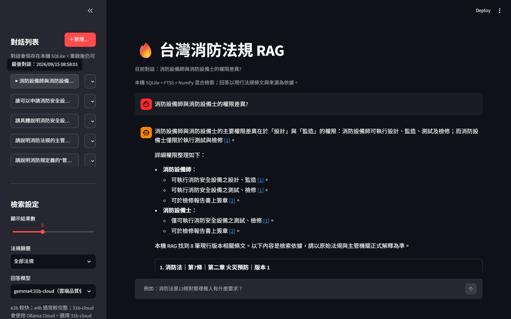
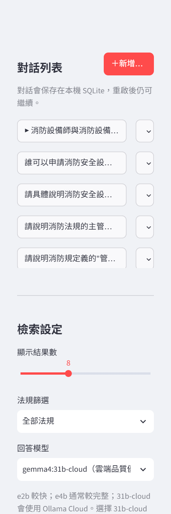
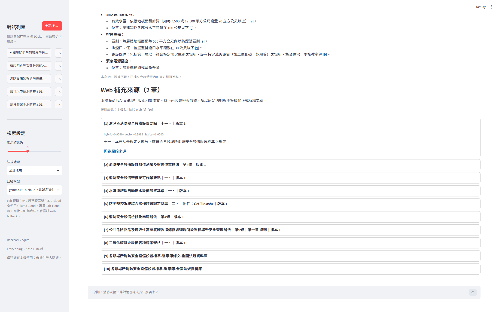

## 1 文件用途與適用範圍

本說明書供使用 Streamlit 前端查詢台灣消防法規的一般使用者與業務人員使用。內容包含啟動、介面辨識、對話管理、檢索設定、提問、法源查核與常見問題。系統預設在 Windows 10/11 本機執行，不需要 Docker、WSL 或 PostgreSQL。

前端用於查詢與閱讀現行版本法規證據。回答是輔助檢索結果，實際法律判斷仍應以主管機關公告、原始法規與正式解釋為準。

## 2 使用前準備

啟動前請確認下列項目。

- 已安裝 Python 3.11 以上版本。
- 專案根目錄已建立 `.venv` 並安裝 `ui` 選配依賴。
- 已建立 `.env`，且已執行資料庫初始化。
- `data/nfa_fire_law.db` 已有法規資料；若尚無資料，應由管理者先完成小量 probe 與增量爬取。

首次安裝可在 PowerShell 執行：

```powershell
python -m venv .venv
Copy-Item .env.example .env
.venv\Scripts\python.exe -m pip install -e ".[ui]"
.venv\Scripts\python.exe -m app.cli init-db
```

## 3 啟動與停止

### 3.1 雙擊啟動

在檔案總管中雙擊 `scripts\start_streamlit.bat`。啟動器會檢查專案的 `.venv` 與 Streamlit，啟動後自動開啟 `http://127.0.0.1:8501`。啟動器不會自動安裝套件，也不會爬取法規。

### 3.2 PowerShell 啟動

```powershell
.venv\Scripts\python.exe -m streamlit run app/streamlit_app.py `
  --server.address 127.0.0.1 `
  --server.port 8501 `
  --browser.gatherUsageStats false
```

頁面上方顯示「台灣消防法規 RAG」後即可開始使用。如果啟動後沒有自動開啟瀏覽器，可手動輸入上述網址。

### 3.3 停止服務

若以 PowerShell 啟動，回到執行視窗按 `Ctrl+C`。若以批次檔啟動，關閉對應的 Streamlit 視窗即可。不要為了釋放 8501 連接埠而任意終止其他程式。

## 4 介面總覽

介面分為左側功能區與右側問答區。左側包含對話列表與檢索設定；右側顯示目前對話、回答、引用與法規證據。



圖 1 前端首頁、對話列表、檢索設定與成功回答區

## 5 對話管理

- 按「＋新增對話」可建立空白對話。
- 按左側對話標題可切換紀錄，目前對話前會顯示指示符號。
- 按對話右側的「⋯」可編輯標題或刪除對話。
- 對話紀錄保存在本機 SQLite，重新啟動後仍可繼續。

刪除對話會移除該對話及其訊息。若需留存紀錄，請在刪除前確認。

## 6 檢索設定



圖 2 左側對話列表與檢索設定

| 設定 | 作用 | 使用建議 |
|---|---|---|
| 顯示結果數 | 設定每次顯示的本機 RAG 證據數，範圍 1 至 20；Web 補充不計入此數量 | 一般問題保留預設 8；複雜比較可適度增加 |
| 法規篩選 | 限定只在指定法規中檢索 | 已知法規名稱時使用；跨法規問題保留「全部法規」 |
| gemma4:e2b | 速度優先的回答模型 | 適合快速查找與較短回答 |
| gemma4:e4b | 品質優先的回答模型 | 適合需要較完整整理的問題 |
| gemma4:31b-cloud | 使用 Ollama Cloud 的雲端品質優先模型 | 需要 `OLLAMA_API_KEY`；證據不足時可嘗試官方網頁補充 |

左側下方會顯示儲存 backend、embedding provider 與向量維度。這些是系統狀態資訊，一般使用者不需要調整。

## 7 提問與回答

### 7.1 建議提問方式

在頁面底部的輸入框輸入自然語言問題，再送出查詢。提問時建議同時提供法規名稱、條號、角色或行為，例如：

- `消防法第13條對管理權人有什麼要求？`
- `消防設備師與消防設備士的業務範圍有何不同？`
- `只查找消防法，說明管理權人的定義。`

系統在處理期間會顯示「正在檢索法規並整理回答」。請等待完成，不要連續重複送出相同問題。

### 7.2 閱讀回答與引用

回答中的 `[1]`、`[2]` 等編號是可點選引用。按編號後會移到對應的證據卡並展開內容。每張本機證據卡顯示：

- 法規名稱、條號或標籤、章節與版本。
- hybrid、vector 與 lexical 檢索分數。
- 作為回答依據的法規原文。
- 「開啟原始來源」連結。

證據卡依編號排列，本機證據從 `[1]` 開始；若另有 Web 補充，會接續編號，例如本機有 8 筆時，Web 證據從 `[9]` 開始。介面會另外顯示本機與 Web 的編號範圍。回答只需引用實際支持主張的證據，不一定會引用畫面上的每一張卡片。



圖 3 成功回答中的引用編號與展開的法規證據卡

### 7.3 官方網頁補充資料

當本機 RAG 沒有結果或最高分數低於設定門檻，且系統已設定 `OLLAMA_API_KEY` 時，雲端模型可嘗試補充允許清單內的 HTTPS 官方網頁。系統會先排除未包含問題明確查詢對象的 Web 結果，再將保留來源接續本機證據編號。介面會標示 Web 筆數、擷取時間與連結。若未設定 key、連線失敗或沒有相關來源，介面會顯示狀態，本機檢索結果仍會保留。

## 8 查核回答的建議流程

1. 先閱讀回答並確認是否直接回應問題。
2. 按回答中的引用編號，核對對應條文。
3. 確認法規名稱、條號、版本與條文內容符合問題。
4. 如果涉及正式法律判斷，按「開啟原始來源」進一步查證。
5. 證據不足時，加入法規名稱、條號或更明確的行為後重新提問。

## 9 常見問題與排除

| 現象 | 處理方式 |
|---|---|
| 瀏覽器無法開啟頁面 | 確認 Streamlit 視窗仍在執行，再開啟 `http://127.0.0.1:8501` |
| 顯示端口被佔用 | 關閉同一專案先前啟動的 Streamlit；不要終止不相干程式 |
| 無法載入法規清單 | 由管理者確認 `.env`、`DATABASE_URL` 與資料庫初始化狀態 |
| 檢索沒有結果 | 改用法規正式名稱、條號或具體關鍵詞；必要時移除過度限定的法規篩選 |
| 顯示 LLM 錯誤 | 法規證據仍可閱讀；請管理者檢查 Ollama 連線、模型名稱、key 與 timeout |
| web fallback 不可用 | 確認是否已設定 `OLLAMA_API_KEY` 與允許的官方網域；本機證據仍可使用 |
| 對話標題或紀錄不如預期 | 重新整理頁面；如果持續發生，請保留錯誤畫面與時間交由管理者檢查 |

## 10 使用與資安邊界

- 介面只綁定 `127.0.0.1`，適合本機使用，未提供登入驗證。
- 不要將介面直接暴露到公開網路或區域網路。
- `.env`、API key、下載附件與本機資料庫不得加入 Git。
- 不建議在問題中輸入不必要的個人資料、機密或認證資訊。

## 11 文件維護與版本對齊

本 Markdown 是前端操作說明書的文字來源，`docs/assets/frontend-user-guide/` 是畫面來源。前端功能、可見文字、使用流程、預設選項、回答狀態、引用或啟動方式異動時，必須在同一次變更中完成：

1. 更新 `docs/FRONTEND_USER_GUIDE.md` 的受影響章節。
2. 重新擷取受影響畫面，不沿用已過時截圖。
3. 執行 `scripts/build_frontend_user_guide.py --format all`，同步產生 Word 與 PDF。
4. 逐頁檢查 Word 轉圖與 PDF 轉圖，確認繁體中文、表格、程式碼、截圖和頁碼清楚易讀。
5. 將 Markdown、截圖、產生器、Word 與 PDF 一併納入同一次 commit。

僅有內部重構且不影響可見行為時，可不重新擷取截圖。實際文件對齊與交付檢查仍以 repository 根目錄 `AGENTS.md` 第 17 節為準。

| 日期 | 版本 | 異動說明 |
|---|---|---|
| 2026-09-15 | 1.2 | 明確區分本機與 Web 證據數，統一 `[N]` 編號與排列順序，加入 Web 相關性說明並更新回答證據截圖 |
| 2026-09-15 | 1.1 | 重新擷取成功回答案例，取代已刪除的失敗案例截圖，並同步更新 Word 與 PDF |
| 2026-09-15 | 1.0 | 建立前端專用操作說明書，納入實際畫面、Word、PDF 與後續對齊規範 |
