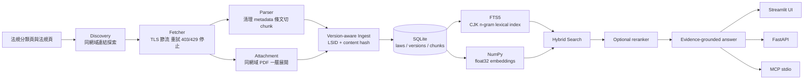

# 台灣消防法規 RAG 系統說明書

本說明書說明台灣消防法規 RAG 的系統架構、法規爬取與版本化設計、檢索與回答流程、安裝啟動方式，以及 Streamlit 前端操作。預設目標是 Windows 10/11 的本機 SQLite 執行環境；Docker、WSL、PostgreSQL 與 pgvector 仍保留為選配相容路徑，不是一般使用的必要條件。

文件版本：2026-09-24

適用版本：Phase 2 / v0.2.x

主要資料來源：台灣消防法規公開查詢網站 `law.nfa.gov.tw`

## 1. 系統定位與使用邊界

本系統將消防相關公開法規抓取、解析、版本保存、索引與檢索整合成可查詢的本機知識庫。回答介面會保留法規名稱、條號或段落標籤、版本號與來源 URL，讓使用者能回到原始法源核對。

系統是法規檢索與證據整理工具，不取代主管機關正式解釋、行政處分或個案法律意見。若檢索證據不足，回答層應顯示資料不足，不應以模型記憶補齊法律結論。

目前支援的來源分類為：

- `A001` 通用法令
- `A002` 預防調查
- `A003` 危險物品管理

## 2. 整體架構



### 2.1 元件與程式位置

| 元件 | 程式位置 | 職責 |
|---|---|---|
| 設定 | `app/config.py`, `.env.example` | 來源網址、資料庫、embedding、LLM、web fallback 與 API 設定 |
| 分類與連結探索 | `app/crawler/categories.py`, `discovery.py` | 解析 A001/A002/A003 分類頁，篩選同網域法規 detail URL |
| HTTP 抓取 | `app/crawler/fetch.py` | TLS 驗證、User-Agent、節流、timeout、有限重試與封鎖停止 |
| 來源 URL 正規化 | `app/crawler/nfa_urls.py` | 擷取 `LSID`、建立穩定法規 identity、組合列印版 URL |
| HTML/PDF 解析 | `app/parser.py`, `app/attachments.py` | 清除頁面雜訊、擷取 metadata、切割條文與附件文字 |
| 入庫與版本 | `app/ingest.py` | unchanged/inserted 判斷、保留歷史版本、寫入 embedding 與 FTS5 |
| 資料庫 | `app/db.py`, `app/models.py` | SQLite schema、交易、foreign key、FTS5、embedding bytes |
| 檢索 | `app/search.py`, `app/embedding.py`, `app/rerank.py` | lexical + vector hybrid、條號與定義訊號、條件式 rerank |
| 回答 | `app/answer.py`, `app/web_search.py` | 只依證據生成、驗證引用、必要時使用官方網域 web fallback |
| API/MCP | `app/api.py`, `app/mcp_server.py` | HTTP API 與 stdio MCP 工具 |
| 前端 | `app/streamlit_app.py`, `app/conversations.py` | 本機問答、對話保存、證據展開與引用定位 |

### 2.2 預設執行模式

預設使用單一 SQLite 檔案 `data/nfa_fire_law.db`，不需要資料庫服務。法規 embedding 預設為 384 維 deterministic character n-gram hash，適合離線 PoC 與無金鑰啟動；它不是訓練好的多語言語意模型。若切換到 OpenAI embedding，必須重新建立所有 chunk 的向量，不能混用不同向量空間。

Ollama/Gemma 是回答層，不是檢索層的必要條件。Ollama 不可用時，仍可使用原始檢索、條文證據與 API；回答層會回報無法產生可驗證引用的狀態。

## 3. 爬取設計重點

### 3.1 探索與來源驗證

1. 從分類頁探索法規連結，不預先寫死法規清單。
2. 只接受與 `NFA_ALLOWED_HOST` 相同的 HTTP/HTTPS host，拒絕外部網址。
3. 排除導覽、列印、新聞、錨點、JavaScript、mailto 與標示為廢止的項目。
4. 以 `LSID` 作為穩定 identity，忽略 `LSID/lsid` 大小寫與歷史 `ldate` 差異。
5. 有 `LSID` 時優先使用 `GNFA/FLAW/PrintFLAWDAT02.aspx` 列印版，失敗才回到原始 detail URL；`Law.source_url` 仍保存人員可辨識的原始法規 URL。

### 3.2 抓取邊界與禮貌策略

- 單執行緒執行，預設 request 間隔 2 秒，可由 `CRAWL_DELAY_SECONDS` 調高。
- 啟用作業系統信任憑證鏈的 TLS 驗證，不應為了抓取方便關閉憑證檢查。
- 網路 timeout 預設 20 秒，網路錯誤最多重試 3 次；HTTP 403 或 429 立即停止整批 crawl，不持續加壓。
- 附件以串流下載，預設上限 25 MB、最多 200 頁；超過大小、頁數、非 PDF 或沒有可搜尋文字的附件會記錄原因並跳過。
- 附件只允許同網域來源，支援「附件清單頁 -> 實際 PDF」一層展開，不把任意頁面變成無限爬蟲圖。

### 3.3 解析、chunk 與 hash

Parser 會清除列印時間、頁尾、導覽與系統提示等動態 chrome，再擷取法規名稱、發布/施行/修正日期、主管機關與法規狀態。正式法規以 `第 X 條` 切割，並辨識條文段落行首的「第六條第一項所定」等交叉引用，避免誤切成另一條；行政規則或附件則可依 `一、二、...`、`（一）` 或阿拉伯數字項次切割。階層式行政規則會把上層節點路徑保存於 heading，使不同章節中重複的 `5.` 等標籤仍可區分。每個 chunk 保存順序、條號或項次、標題與完整文字。version metadata 另保存 `parser_revision`，用來判斷既有 chunks 是否需要受控重建，不把 parser 改版誤認為法規內容修正。

`content_hash` 只對穩定的法規內容與重要 metadata 計算 SHA-256，刻意排除每次抓取都會變動的列印時間。因此同一法規內容未變更時不會重複新增版本，也不會重做 embedding。

### 3.4 增量版本策略

| 情況 | 入庫結果 |
|---|---|
| 找不到相同 `source_key` | 建立 `Law`、版本 1、chunks、embedding 與 FTS5 |
| 相同 identity、現行 `content_hash` 與 `parser_revision` 均不變 | 回報 `unchanged`，保留原 current version |
| 來源未變但現行 `parser_revision` 落後 | 回報 `reprocess_required`，不自動增加法規版本 |
| 相同 identity 但內容變更 | 舊版 `is_current=false`，新增 version_no、chunks、embedding，更新 FTS5 |
| 新內容與某個非現行歷史 hash 相同 | 仍新增下一個 version_no，保留完整時間序，不重新啟用舊列 |
| 單一附件失敗 | 保存錯誤/跳過原因到 version metadata，不中斷其他法規 |

一般更新先做小量 probe，再做 `--max-laws` 小量 crawl，確認結果後才執行完整增量同步。crawl 不會刪除歷史版本；若來源內容回復成先前文字，系統會建立新的時間序版本，避免 current 指標停留在錯誤版本。例行測試不得對真實 local database 做 destructive setup，也不應在未確認網站可達性時直接完整 crawl。

## 4. 資料模型與可追溯性

| 資料表 | 主要內容 |
|---|---|
| `laws` | 穩定 `source_key`、法規名稱、分類、原始來源 URL |
| `law_versions` | 版本號、content hash、完整 raw text、metadata、current 狀態、抓取時間 |
| `law_chunks` | version 關聯、seq、條號、標題、chunk 內容、float32 embedding |
| `law_chunks_fts` | SQLite FTS5 lexical index，只重建現行版本，並保存 chunk/law/version 對照欄位 |
| `conversations` | Streamlit 本機對話標題與時間 |
| `conversation_messages` | 使用者問題、助手輸出與完整 response JSON |

所有回答面向的結果至少應帶出：法規名稱、條號/段落標籤、版本號、原始來源 URL。`version_no` 是系統保留版本的序號；真正法律效力仍應回到來源頁面的發布、施行或修正日期核對。

## 5. 檢索與回答流程

### 5.1 Hybrid search

SQLite 檢索先以 FTS5 取得候選，再以 NumPy 計算 embedding cosine similarity，並融合文字重疊、法規名稱 routing、明確條號、「本法所稱 X」定義句型及包含問題的精確對象訊號。中文查詢使用 character n-gram，避免只依賴空格分詞。預設 hash embedding 的 vector weight 為 0.30，讓可解釋的法律詞彙訊號優先。

`/v1/search` 與 MCP `search_fire_law` 提供原始檢索排序；`/v1/ask`、MCP `ask_fire_law` 與 Streamlit 問答會對「包含哪些、是否包含某對象」或「某主題相關規定」等跨法規問題取得 bounded candidate pool，保留不同法規來源、直接主管辦法及最相關母法。初步選擇以不同法規優先，同一法規最多兩筆，再依原始相關度補滿；回答證據先列直接主管辦法或涵蓋明確對象的條文，再列相關母法。此順序不改寫原始 hybrid、vector 或 lexical 分數，也不把法律位階當作檢索分數。角色比較、權限或業務範圍問題則取得較大候選集，再由設定的 Gemma 進行條件式重排。重排失敗會安全回退原始排序。

完整列舉與相關性排序是不同需求。當問題明確指定一個法規、包含「所有／全部／完整／逐條」意圖，且主題可對應「懲處／處罰／裁罰／罰則」時，回答入口會精確限制法規名稱，依現行版本的「罰則」章節與 `LawChunk.seq` 取回全部實質條文，排除刪除條文。此結構式模式不套用一般 `top_k` 截斷，也不以 synthetic 分數取代原始 hybrid 分數；API、MCP 與前端均回報檢索模式、章節範圍、總筆數、回傳筆數及完整狀態。一般查詢仍維持原本的 hybrid／多樣化／條件式 rerank 流程。

### 5.2 證據回答與 web fallback

回答 prompt 只會收到現行本機檢索片段，並要求每個重要法律主張附 `[1]`、`[2]` 等證據編號。系統會拒絕不存在或完全缺少的引用；此時保留原始條文給使用者核對，不把未驗證文字當作可靠法律答案。

同一法規、版本與來源 URL 的多筆章節證據會在 prompt 中保留第一筆完整來源，後續以引用第一筆來源的方式壓縮重複 provenance；條文原文、條號、章節與引用編號仍完整保留。完整結構式結果不會因 placeholder 分數偏低而觸發 web fallback。

回答長度依前端選定模型套用獨立 profile，而不是共用 512 tokens：`gemma4:e2b` 預設 context/output 為 `8192/2048`、`gemma4:e4b` 為 `16384/4096`、`gemma4:31b-cloud` 為 `262144/8192`。effective output 取「設定輸出上限」與「context 扣除估計 prompt 及安全餘量」的較小值；本機模型還會以快取的 `/api/show` 架構 context 作上限。系統保存 `done_reason`、prompt/eval token count 與重試次數；長度截斷或疑似半句會精簡重試一次，仍未完成則回傳 `answer_status=incomplete`。

當本機無命中、最高 hybrid 分數低於 `WEB_SEARCH_MIN_HYBRID_SCORE`，或模型明確表示證據不足時，可選擇啟用 Ollama hosted web search。Web 結果只接受 `.env` 的 HTTPS 官方網域清單；若問題明確詢問是否包含某對象，還必須在標題或擷取內容中涵蓋該對象，避免泛稱「相關法條」但未支持問題的頁面進入回答證據。保留結果會標示為「官方網頁補充資料」與擷取時間，不能默默覆蓋或合併本機現行法規。

## 6. 安裝與啟動

以下以 Windows PowerShell 為主。指令應在 repository 根目錄執行。

### 6.1 前置條件

- Windows 10/11
- Python 3.11 以上，建議使用 repository 內的 `.venv`
- 可連線來源網站的環境，只有 probe/crawl 需要外部網路
- 不需要 Docker、WSL、PostgreSQL 或系統管理員權限

### 6.2 建立環境與安裝

```powershell
python --version
python -m venv .venv
Copy-Item .env.example .env
.venv\Scripts\python.exe -m pip install --upgrade pip
.venv\Scripts\python.exe -m pip install -e ".[dev,ui]"
```

`.env` 是本機設定檔，不可提交 Git。初次使用可先維持預設的 SQLite、hash embedding；若要使用 OpenAI embedding 或 Ollama Cloud，才填入對應金鑰。API 與 UI 預設應綁定 loopback 使用，公開部署前必須先補認證與反向代理控管。

### 6.3 初始化資料庫與確認 API

```powershell
.venv\Scripts\python.exe -m app.cli init-db
.venv\Scripts\python.exe -m uvicorn app.api:app --host 127.0.0.1 --port 8000
```

另開一個 PowerShell 視窗確認：

```powershell
Invoke-RestMethod http://127.0.0.1:8000/health
Start-Process http://127.0.0.1:8000/docs
```

API 要長駐執行時，請保留該視窗；停止可按 `Ctrl+C`。`/v1/admin/crawl` 目前沒有登入認證，只適合本機或受控內網使用。

### 6.4 首次 probe 與增量爬取

```powershell
.venv\Scripts\python.exe -m app.cli probe --max-laws 3
.venv\Scripts\python.exe -m app.cli crawl --categories A001,A002,A003 --max-laws 3
```

小量結果正常後，再執行：

```powershell
.venv\Scripts\python.exe -m app.cli crawl --categories A001,A002,A003
```

單一分類也可使用：

```powershell
.venv\Scripts\python.exe -m app.cli crawl --max-laws 3
```

`probe` 不需資料庫與 embedding，會回報 `LSID`、retrieved URL、chunk 數、首末條號、metadata、content hash 與附件 URL，適合先確認站台格式。`crawl` 是增量操作，未變更法規不會建立新版本。

### 6.5 Parser 升版後重建現行 chunks

parser/chunk 規則升版後，先執行 dry-run；此步驟不連網也不寫入資料：

```powershell
.venv\Scripts\python.exe -m app.cli reprocess-current
```

輸出會列出法規 ID、版本、舊/新 parser revision、chunk 數及 hash 是否變動。確認清單後，先複製備份 `data\nfa_fire_law.db`，再套用：

```powershell
.venv\Scripts\python.exe -m app.cli reprocess-current --apply
```

如只處理特定法規，可重複使用 `--law-id`。套用作業在單一資料庫交易中，僅重建現行版本的 chunks、embedding、metadata/hash 與 current-only FTS；不改 `version_no`，也不刪除或重新啟用歷史版本。若 embedding provider 已改變，不應把本命令當成跨 provider migration，仍須先確認整庫向量相容性。

### 6.6 啟動 Streamlit 前端

方法一：雙擊 `scripts\start_streamlit.bat`。啟動器會檢查 `.venv` 與 Streamlit，確認 `8501` port，僅停止本 repository 自己留下的舊 Streamlit process，等待 health endpoint 後開啟瀏覽器。Windows venv 可能讓監聽子程序顯示為系統 Python，因此辨識時會向上檢查最多四層父程序；只有命令列同時包含 repository 絕對路徑與 `streamlit` 才會終止該程序樹，其他占用者仍維持 fail-closed。

方法二：PowerShell 手動啟動：

```powershell
.venv\Scripts\python.exe -m streamlit run app/streamlit_app.py `
  --server.headless true `
  --server.address 127.0.0.1 `
  --server.port 8501 `
  --browser.gatherUsageStats false
```

開啟 `http://127.0.0.1:8501`。若只使用 UI，仍建議先完成 `init-db` 與至少一次 crawl；UI 啟動時會自動初始化 schema，但不會自動爬取法規。

### 6.7 API、MCP 與評估入口

常用 API：

```powershell
Invoke-RestMethod "http://127.0.0.1:8000/v1/laws"
Invoke-RestMethod "http://127.0.0.1:8000/v1/search?q=防火管理人有哪些責任&top_k=8"
Invoke-RestMethod "http://127.0.0.1:8000/v1/article?law_title=消防法&article=第13條"
```

MCP 使用 stdio；在 MCP client 設定中以 repository 內的 Python 啟動：

```json
{
  "mcpServers": {
    "nfa-fire-law": {
      "command": "C:\\path\\to\\nfa-fire-law-rag\\.venv\\Scripts\\python.exe",
      "args": ["-m", "app.mcp_server"],
      "cwd": "C:\\path\\to\\nfa-fire-law-rag"
    }
  }
}
```

提供的 MCP 工具為 `search_fire_law`、`ask_fire_law`、`get_fire_law_article`、`list_fire_laws`、`list_law_versions`。檢索 smoke test：

```powershell
.venv\Scripts\python.exe -m app.cli eval --path eval/phase2_queries.json --top-k 8
```

## 7. Streamlit 前端操作說明

### 7.1 側邊欄

- **對話列表**：選擇既有對話；對話會保存於本機 SQLite，重啟後仍可查看。
- **新增對話**：建立空白對話。
- **... 選單**：修改對話標題或刪除對話。刪除會移除該對話及其訊息，不會刪除法規資料。
- **顯示結果數**：控制一般查詢顯示 1 至 20 筆本機 RAG 證據；Web 補充不計入此數量。完整列舉問題可依章節自動超過此數量。
- **法規篩選**：選擇全部法規或限定某一法規名稱。
- **回答模型**：`gemma4:e2b` 偏速度、`gemma4:e4b` 偏完整、`gemma4:31b-cloud` 偏雲端品質；這是當次查詢選擇，不會改寫全域設定，且會一併選取相應的 context/output profile。

### 7.2 問答與證據

在底部輸入自然語言問題，例如「消防法第13條對管理權人有什麼要求？」。回答區會依序顯示：模型回答或資料不足提示、本機檢索摘要、現行法規證據卡片，以及必要時的 web 補充來源。啟動、重新整理、完成回答或切換左側對話時，前端會將視窗定位在該對話最新一輪的問題起點，而不是自動捲到最下方；空白對話沒有定位目標時則不強制捲動。

本機證據卡片嚴格依 `[1]` 至 `[N]` 的引用編號順序顯示，`top_k` 計算一般查詢的個別條文；每張 hybrid 卡片保留獨立 `[N]`、法規名稱、條號、標題、版本與 hybrid/vector/lexical 分數，再接續 Web 證據。完整列舉時，畫面改顯示結構式章節檢索、章節範圍與例如 `21／21` 的覆蓋數，並按法規原始條文順序顯示。畫面另列本機與 Web 的編號範圍。點擊卡片可展開原文；點擊回答中的 `[N]` 引用會跳到並展開對應證據。回答下方顯示模型、實際輸出 token 數、當次有效輸出上限、中文生成狀態及重試次數；原始 `done_reason` 仍保留在回應資料中。**分數是排序訊號，不是法律效力。**

若看到「RAG 證據不足」提示，應優先改用更具體的法規名稱、條號、角色或動作詞，再檢查原始來源。web fallback 若無金鑰、無結果或連線失敗，介面仍會顯示本機檢索結果與狀態，不會假裝已完成外部查詢。

### 7.3 建議提問方式

- 具體指定法規名稱與條號：`消防法第13條管理權人義務`
- 問定義時指出名詞：`消防法所稱管理權人是什麼`
- 問責任時指出動作：`防火管理人應負哪些責任`
- 比較不同角色時說明比較面向：`管理權人與防火管理人的設置及責任有何不同`

## 8. 設定與故障排除

| 現象 | 優先檢查 |
|---|---|
| `ModuleNotFoundError` | 是否使用 `.venv\Scripts\python.exe`，以及是否已安裝 `-e ".[dev,ui]"` |
| UI 顯示沒有資料 | 確認 `DATABASE_URL`、執行 `init-db`，再做 probe/crawl |
| 來源站 DNS/連線失敗 | 先只做 `probe --max-laws 3`；確認網路政策與 `NFA_ALLOWED_HOST`，不要直接完整 crawl |
| HTTP 403/429 | 依程式停止，稍後再試並提高 `CRAWL_DELAY_SECONDS`，不要增加併發或重試壓力 |
| Ollama 回答失敗 | 先使用 `/v1/search` 或查看證據；確認 Ollama URL、模型與金鑰。檢索本身不依賴 Ollama |
| 回答顯示未完整 | 查看生成狀態、實際輸出／上限與重試次數；縮小問題或減少結果數。系統不會把長度截斷標成正常答案 |
| Cloud/web fallback 不可用 | 確認 `OLLAMA_API_KEY`、允許網域與 HTTPS；未設定時屬預期的 unavailable 狀態 |
| Streamlit port 被占用 | 重新執行新版啟動器；它會辨識本 repository 的 Windows venv 父子程序鏈並安全重啟。若仍顯示不相關 PID，表示無法安全確認擁有者，應人工核對後關閉或修改 port，不要任意終止 process |
| 切換 embedding provider | 使用新的 `DATABASE_URL` 或受控 re-embedding 流程，先備份 SQLite，避免混用向量 |
| crawl 顯示 `reprocess_required` | 先執行 `reprocess-current` dry-run，備份 SQLite 後再以 `--apply` 重建現行衍生資料 |

## 9. 文件維護與變更紀錄

本手冊負責說明系統如何使用；後續程式異動的文件責任、對齊矩陣與交付檢查表，統一依 repository 根目錄的 [`AGENTS.md`](../AGENTS.md) 第 17 節執行。採影響範圍驅動的方式維護文件：只有影響操作、資料契約、來源規則、執行方式、資安邊界或驗證方式的變更，才需要同步受影響文件。PDF 是本手冊的列印與分享版本，由 `scripts/build_system_manual_pdf.py` 產生，不直接手工編輯。

| 日期 | 內容 |
|---|---|
| 2026-09-24 | 修正 Windows venv 啟動器辨識；加入完整列舉罰則檢索與覆蓋 metadata |
| 2026-09-22 | 問答載入、回答完成及切換對話時，視窗定位到最新問題起點 |
| 2026-09-17 | 證據卡改為依引用編號順序顯示，避免同法規集中顯示造成跳號 |
| 2026-09-16 | 回答診斷列加入實際輸出 token 數，並將原始終止碼轉為易懂的中文生成狀態 |
| 2026-09-16 | 加入 parser revision、條文交叉引用防誤切、歷史 hash 回復保護，以及 dry-run 優先的 `reprocess-current` 工作流程 |
| 2026-09-16 | 加入跨法規主題覆蓋、證據來源多樣化、階層項次、模型別 token profile 與截斷偵測/重試 |
| 2026-09-16 | 統一產品名稱為「台灣消防法規 RAG」，來源說明改用中性名稱 |
| 2026-09-16 | 複合包含問題先列直接對象條文，再列相關母法，並保留原始檢索分數 |
| 2026-09-15 | 加入複合包含問題的證據覆蓋、Web 明確對象過濾，以及統一的本機／Web 引用編號呈現 |
| 2026-09-14 | 建立系統說明書與 Markdown 產生的 PDF，納入架構、爬取、啟動、Streamlit 操作及 `AGENTS.md` 文件對齊規範 |
